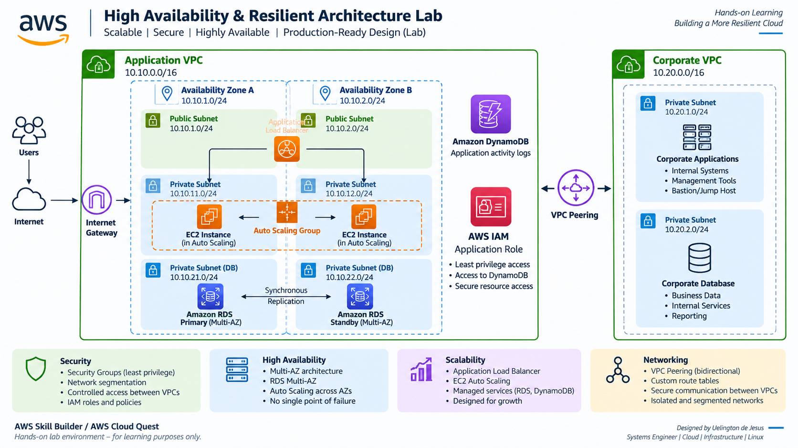

# AWS High Availability & Resilient Architecture Lab ☁️

Hands-on AWS architecture lab focused on building a more resilient, scalable, secure, and highly available cloud environment.

## 🏗️ Architecture Diagram

The diagram below represents the target architecture after implementing the availability, scalability, networking, security, and access-control improvements explored during the lab.

## 🎯 Project Objective

The objective of this lab was to identify and fix architectural issues in an AWS environment that could affect availability, scalability, security, and communication between resources.

The environment initially contained several single points of failure and configuration issues. Each challenge required analyzing the existing architecture and implementing the appropriate AWS solution.

## 🛠️ AWS Services & Concepts

- Amazon EC2
- EC2 Auto Scaling
- Amazon RDS Multi-AZ
- Amazon DynamoDB
- Amazon VPC
- VPC Peering
- Route Tables
- Security Groups
- AWS IAM
- Availability Zones

## 🏗️ Architecture Improvements

During the lab, I implemented improvements involving:

- Database high availability using **Amazon RDS Multi-AZ**
- Application scaling across **multiple Availability Zones**
- Network communication between VPCs using **VPC Peering**
- Route table configuration for bidirectional communication
- Security Group rules based on the **least privilege principle**
- A DynamoDB table for application activity logs
- IAM permissions allowing the application to securely read DynamoDB data

## 🔎 Challenges & Solutions

### 1. Database High Availability — Amazon RDS Multi-AZ

**Problem:**  
The relational database was running in a single Availability Zone, creating a single point of failure.

**Analysis:**  
If the Availability Zone hosting the database became unavailable, the application could lose access to its relational database.

**Solution:**  
Enabled **Multi-AZ deployment** for Amazon RDS, providing a synchronous standby replica in another Availability Zone and improving database availability.

**Concepts:** `Amazon RDS` `Multi-AZ` `High Availability` `Fault Tolerance`

---

### 2. Secure Application-to-Database Communication

**Problem:**  
The application servers could not connect to the database because the database Security Group did not allow the required inbound traffic.

**Analysis:**  
Opening the database to unrestricted sources would solve connectivity but introduce unnecessary security exposure.

**Solution:**  
Configured the database Security Group to allow **TCP port 3306** only from the application's Security Group.

**Concepts:** `Security Groups` `Least Privilege` `Network Security`

---

### 3. Activity Logging with Amazon DynamoDB

**Problem:**  
The application required a scalable data store for activity logs.

**Solution:**  
Created an **Amazon DynamoDB** table named `ActivityLog`, using `activityId` as the partition key.

**Concepts:** `DynamoDB` `NoSQL` `Managed Services`

---

### 4. VPC Peering and Bidirectional Routing

**Problem:**  
The Application VPC and Corporate VPC had an existing VPC Peering connection but could not communicate correctly.

**Analysis:**  
The Corporate VPC had a route to the Application VPC, but the Application VPC lacked the corresponding return route.

**Solution:**  
Configured the private route tables in the Application VPC with a route to the Corporate VPC CIDR through the existing **VPC Peering connection**, enabling bidirectional communication.

**Concepts:** `Amazon VPC` `VPC Peering` `Route Tables` `CIDR` `Networking`

---

### 5. Application High Availability with EC2 Auto Scaling

**Problem:**  
The application was running on a single EC2 instance in one Availability Zone.

**Analysis:**  
A failure affecting that instance or Availability Zone could make the application unavailable.

**Solution:**  
Configured the **EC2 Auto Scaling Group** to use private subnets across two Availability Zones and increased the desired capacity to two instances.

**Concepts:** `Amazon EC2` `Auto Scaling` `Availability Zones` `High Availability`

---

### 6. IAM Access to DynamoDB

**Problem:**  
The application's IAM role did not have permission to read data from the DynamoDB activity log table.

**Analysis:**  
The application required read access without unnecessary write permissions.

**Solution:**  
Attached the AWS managed policy **AmazonDynamoDBReadOnlyAccess** to the application's IAM role.

**Concepts:** `AWS IAM` `IAM Roles` `Managed Policies` `Least Privilege`

## 📚 Key Learning Outcomes

This project strengthened my practical understanding of:

- High availability and fault tolerance
- Multi-AZ architectures
- Network routing between AWS VPCs
- Identity and access management
- Infrastructure security
- Application scalability
- Managed database services

## 📌 Project Context

This repository documents a hands-on AWS training lab completed through **AWS Skill Builder / AWS Cloud Quest**.

The environment was created specifically for training purposes and does not represent a production workload.
